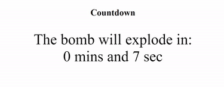

<h1>Countdown Timer</h1>

A bare bones raw Javascript timer that works by manipulating innerHTML.

To run in VSCode:

<ol>
    <li> Install the Live Server extension - Open VSCode, type ctrl+P, type ext install ritwickdey.liveserver
    </li>
    <li> Right click index.html and click Open with Live Server
    </li>
</ol>

